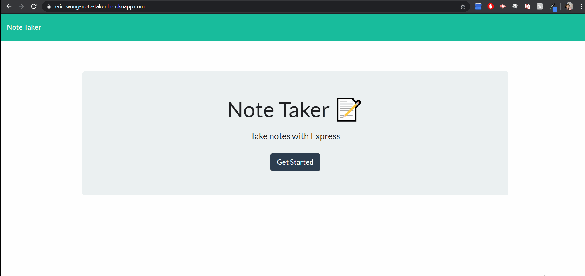

# Note Taker
This is an application for users who want to take quick notes. User could add as much each individual notes as they want, once the note is no longer valid. The user can click on the red trash can to get rid of the note.
###  <a href = "https://ericcwong-note-taker.herokuapp.com/" target="_blank">deployed</a> Link

###  <a href = "https://github.com/Ericcwong/Note-Taker" target="_blank">GitHub</a> Link

## Getting started 

To get started, you can use this application through two different ways.   
<strong><a href="https://ericcwong-note-taker.herokuapp.com/">Deployed</a></strong> link, this being the easiest is going through Heroku. Going through Heroku means the application will be all ready for use!    
The other is going through the <strong><a href="https://github.com/Ericcwong/Note-Taker">Git Hub</a></strong> page. You would have to download the files, head to server.js. Once inside server.js run in terminal and type in (node server.js). The local server will start and in your browser's search bar, type localhost:8000. The application will be hosted through localhost.

# Credit
<strong>Jonathan Bejarano (Instructor)</strong> Jonathan helped me dissect the delete functionality. I had to use the filter opperator.  
Others quick references being 
<ul>
    <li>w3School</li>
    <li>Stack Oveflow</li>
    <li>Other website that helped with Express and server sided Javascript</li>
</ul>

# Copyright
Code is free to view and use, as long as credit is given in read me.